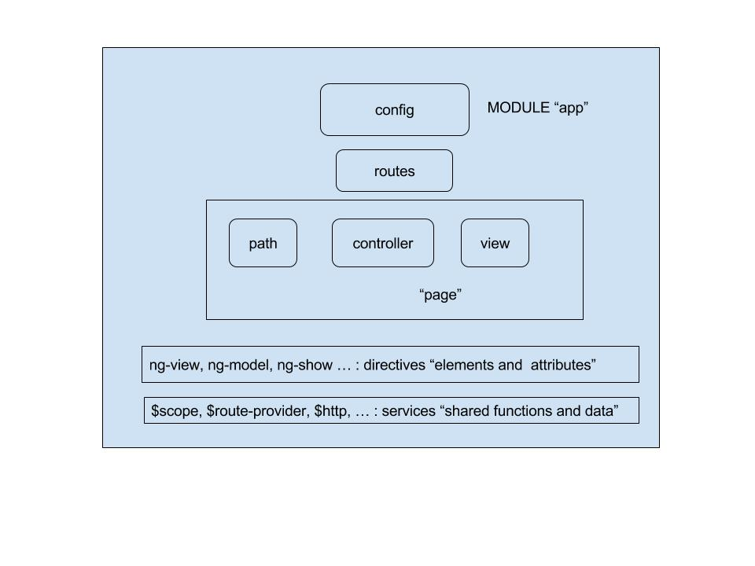

#### Anuglar routing

#### boilerplate inventory
* webpack.config.js: adding html module loader, npm install --save-dev html-loader  
* server.js - small node server for static file service
* README.md - description of project
* package.json - adding dependency for anuglar-route : npm install angular-route --save
* karma - not using router injection yet
* .git - your git repo
* .gitignore - ingore build, env.sh - may add to this
* .eslintrc - standard 
* .eslintignore - node modules, vendors, markdown, text, package.json
* test folder - name your tests *-test.js might - add ingore angular
* build - statics files should include index.html, bundle.css, bundle.js
* app - all files to be loaded by entry.js
* .vscode - if you're using Visual Studio Code - helps with formatting

#### inside app folder  
* html index.html should get copied to build - contains ng-view
* scss - folder contain sass
* scss/base.scss - your global css
* scss/lib/_theme.scss - your global css variables
* scss/vendor/... - look for bootstrap, font-awesome, normaliza
* scss/vendor/bootstrap/stylesheets/_bootstrap.scss - you can modify to bring in more or less bootstrap 
* view - your view code - partial that would get loaded bith ng-view
* view/home - you'll want an index.js binds a controller to the app
* view/*.html - file with partial html that can use data in controller (angular will bind this to the controller)

* npm install angular-route --save-dev
* add html loader to web.config.js

